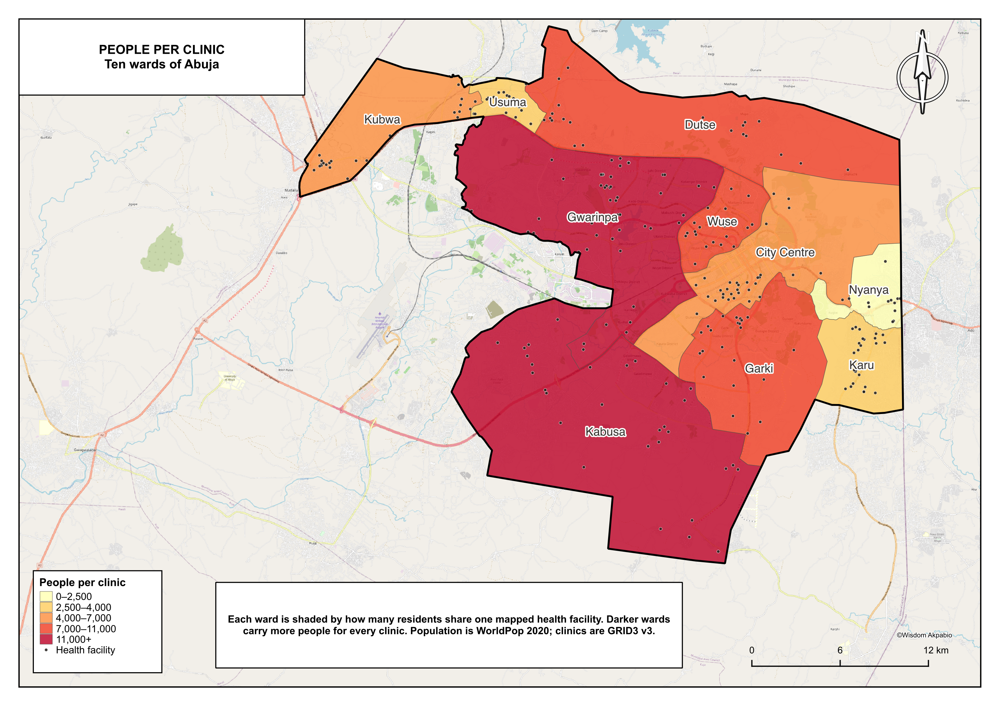

# Healthcare Access Gaps in Central Abuja, FCT, Nigeria

Which wards in central Abuja have the fewest health facilities relative to their population?

## The answer

**Kabusa is the most underserved ward: about 14,500 residents for every mapped health facility.** Gwarinpa (11,400), Garki (10,800) and Dutse (10,500) come next. Nyanya (2,400) and Karu (2,600) are the best served.

Gwarinpa has more clinics than any other ward (51) and is still the second most pressured, because it also has the most people (about 582,000). Counting clinics alone would have called it well served.

| Ward | Area council | Clinics | People (2020) | People per clinic |
|---|---|---|---|---|
| Kabusa | AMAC | 30 | 434,789 | 14,493 |
| Gwarinpa | AMAC | 51 | 582,288 | 11,417 |
| Garki | AMAC | 23 | 247,312 | 10,753 |
| Dutse | Bwari | 21 | 221,209 | 10,534 |
| Wuse | AMAC | 20 | 195,387 | 9,769 |
| City Centre | AMAC | 33 | 230,486 | 6,984 |
| Kubwa | Bwari | 24 | 139,993 | 5,833 |
| Usuma | Bwari | 19 | 75,943 | 3,997 |
| Karu | AMAC | 25 | 66,173 | 2,647 |
| Nyanya | AMAC | 13 | 31,328 | 2,410 |

Read these as a floor on pressure, not an exact count. They cover only GRID3 facilities that have coordinates: 265 of the 519 AMAC-tagged records and 25 of the 147 Bwari-tagged records have none. Population is WorldPop 2020.

## The four weeks

| Week | What I did | Where it is |
|---|---|---|
| 1 | Set the question, why it matters, and the data needed, with a source link for every dataset | [PROJECT_BRIEF.md](PROJECT_BRIEF.md) |
| 2 | Downloaded GRID3 wards, GRID3 health facilities and WorldPop 2020, clipped them to AMAC, and described what I got | [DATA_NOTE.md](DATA_NOTE.md) · [data/processed/](data/processed/) · [qgis/amac_week2.qgz](qgis/amac_week2.qgz) |
| 3 | Narrowed to the ten study wards, reprojected to UTM 32N (EPSG:32632), clipped, and ran five quality checks | [WEEK3_PREP_NOTE.md](WEEK3_PREP_NOTE.md) · [data/processed/amac_analysis_ready.gpkg](data/processed/amac_analysis_ready.gpkg) · [qgis/amac_week3.qgz](qgis/amac_week3.qgz) |
| 4 | Wrote a prediction, counted facilities per ward with a spatial join, checked the result four ways, and mapped it | [MONTH1_PREDICTION.md](MONTH1_PREDICTION.md) · [month-1-summary.md](month-1-summary.md) · [data/processed/month1_ward_facility_counts.gpkg](data/processed/month1_ward_facility_counts.gpkg) · [maps/people_per_facility.png](maps/people_per_facility.png) |

## How the weeks connect

Week 1 asked the question for all of AMAC. Week 2 gathered the three layers that question needs (wards, facilities, people) and found the gaps, most importantly that half of AMAC's GRID3 facility records have no coordinates. Week 3 narrowed the study to the ten wards where people live, the same outline as my 15-minute-city maps. It moved everything into a metre-based coordinate system so areas are real, and checked the data before trusting it. Week 4 used that prepared file to answer the Week 1 question.

## Study area

Ten FCT wards: Gwarinpa, Wuse, Nyanya, Karu, City Centre, Garki and Kabusa in AMAC, plus Kubwa, Dutse and Usuma in Bwari. Together they cover 793 km² and about 2.2 million people. The rest of AMAC (Gui, Orozo, Gwagwa, Jiwa, Karshi) and rural Bwari are outside the study.

## Data sources

- GRID3 NGA Health Facilities v3.0 — https://data.humdata.org/dataset/grid3-nga-health-facilities-v3-0
- GRID3 NGA Operational Wards v3.0 (Weeks 1–2) — https://data.humdata.org/dataset/grid3-nga-operational-wards-v3-0
- GRID3 NGA Operational Wards v1.0, vaccination wards (Weeks 3–4) — https://grid3.org/geospatial-data-nigeria
- WorldPop Nigeria 2020 constrained 100 m — https://data.humdata.org/dataset/worldpop-population-counts-for-nigeria

## Open it yourself

1. Clone the repo.
2. Open `qgis/amac_week3.qgz` in QGIS, or add the layers from `data/processed/month1_ward_facility_counts.gpkg` (ward counts, facilities and study boundary, all in EPSG:32632).
3. Read the four weeks in order from the table above.

## What comes next

People-per-clinic treats each ward as sealed off, but a Gwarinpa resident can use a clinic in Wuse. The next step is a supply surface that reaches across ward edges, weighted by facility level, followed by walking distance on the street network. The end goal is the dashboard described in the brief.

## Author
Wisdom Emem Akpabio
